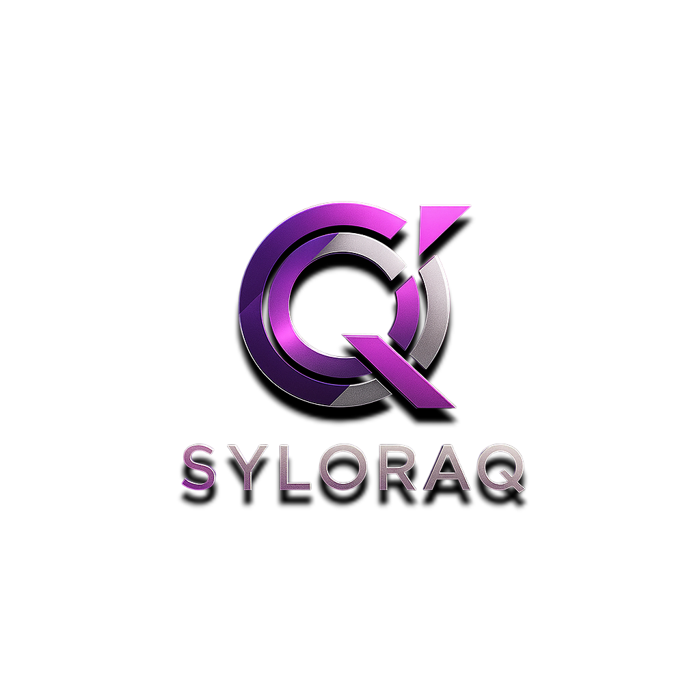

  

# Who is SyloraQ?:
SyloraQ is owner of the GBS BLP JPM and some other projects!

# SyloraQ:
SyloraQ is a module that adds new functions to **python** and simplify the existing ones...

# Guide:
Click [GUIDE](GUIDE.md) to see it.

# Install command:
**pip install SyloraQ**

# PyPI:
[SyloraQ PyPI](https://pypi.org/project/SyloraQ/)

# License:
This project is licensed under the [Private Use License](LICENSE.md).

# My youtube channel:
[SyloraQ](https://www.youtube.com/@SyloraQ)

**For the exe files you can check [ByteLightProject](https://github.com/GoodByeSyntax/ByteLightProject).**

---

# **Coding**
SQ: [Here](youtube.com/channel/UCOvDKDUeQXqxkit2_mngZDQ/?sub_confirmation=1)

GBS: [Here](https://pypi.org/project/GoodByeSyntax) 

BLP: [Here](https://pypi.org/project/ByteLightProject) 

JPM: [Here](https://pypi.org/project/JynPopMod) 

Jai: [Here](https://pypi.org/project/JynAi)

# **Platforms**
Youtube: [Here](youtube.com/channel/UCOvDKDUeQXqxkit2_mngZDQ/?sub_confirmation=1)

Discord: [Here](https://discord.gg/RsfeV3Jw)

Github: [Here](https://github.com/SyloraQ)s

# **Contact**
Gmail: mail sevice is coming as soon as possible!

# **How Do i suggest?**
Join [Our Discord](https://discord.gg/RsfeV3Jw) and suggest your suggestion in suggestions channel

# **Getting help**
Just like Suggesting join the discord server and report the problem in help or bugs channel
